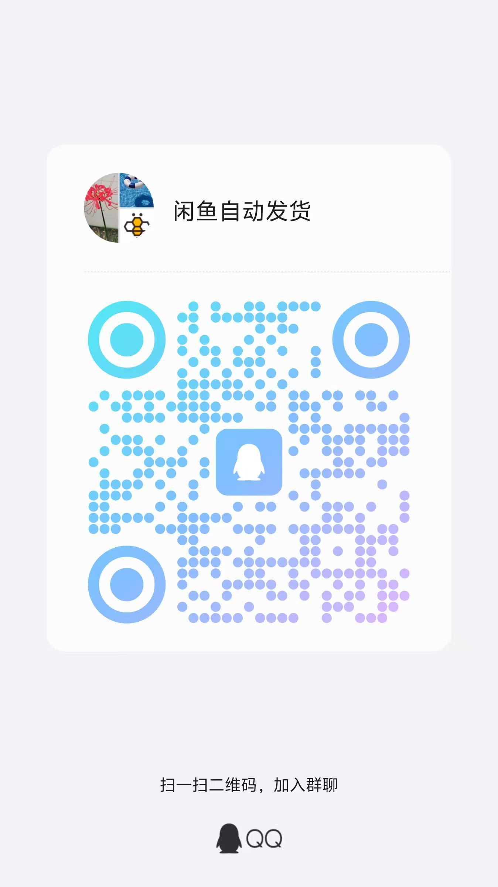

# 🐟 闲鱼自动回复系统

[](https://github.com/zhinianboke/xianyu-auto-reply)
[](https://github.com/zhinianboke/xianyu-auto-reply#-快速开始)
[](https://www.python.org/)
[](#️-版权声明与使用条款)

## 最新代码获取地址

我用夸克网盘给你分享了「自动发货系统源码」，点击链接或复制整段内容，打开「夸克APP」即可获取。 /~5e4237vG5B~:/ 链接：https://pan.quark.cn/s/88d118bd700e

> **⚠️ 重要提示：本项目仅供学习研究使用，严禁商业用途！使用前请仔细阅读[版权声明](#️-版权声明与使用条款)。**

一个功能完整的闲鱼自动回复和管理系统，支持多用户、多账号管理，具备智能回复、自动发货、自动确认发货、商品管理等企业级功能。

## ✨ 核心特性

### 🔐 多用户系统
- **用户注册登录** - 支持邮箱验证码注册，图形验证码保护
- **数据完全隔离** - 每个用户的数据独立存储，互不干扰
- **权限管理** - 严格的用户权限控制和JWT认证
- **安全保护** - 防暴力破解、会话管理、安全日志

### 📱 多账号管理
- **无限账号支持** - 每个用户可管理多个闲鱼账号
- **独立运行** - 每个账号独立监控，互不影响
- **实时状态** - 账号连接状态实时监控
- **批量操作** - 支持批量启动、停止账号任务

### 🤖 智能回复系统
- **关键词匹配** - 支持精确关键词匹配回复
- **指定商品回复** - 支持为特定商品设置专门的回复内容，优先级最高
- **商品专用关键词** - 支持为特定商品设置专用关键词回复
- **通用关键词** - 支持全局通用关键词，适用于所有商品
- **批量导入导出** - 支持Excel格式的关键词批量导入导出
- **AI智能回复** - 集成OpenAI API，支持上下文理解
- **变量替换** - 回复内容支持动态变量（用户名、商品信息、商品ID等）
- **优先级策略** - 指定商品回复 > 商品专用关键词 > 通用关键词 > 默认回复 > AI回复

### 🚚 自动发货功能
- **智能匹配** - 基于商品信息自动匹配发货规则
- **多规格支持** - 支持同一商品的不同规格自动匹配对应卡券
- **精确匹配+兜底机制** - 优先精确匹配规格，失败时自动降级到普通卡券
- **延时发货** - 支持设置发货延时时间（0-3600秒）
- **多种触发** - 支持付款消息、小刀消息等多种触发条件
- **防重复发货** - 智能防重复机制，避免重复发货
- **多种发货方式** - 支持固定文字、批量数据、API调用、图片发货等方式
- **图片发货** - 支持上传图片并自动发送给买家，图片自动上传到CDN
- **自动确认发货** - 检测到付款后自动调用闲鱼API确认发货，支持锁机制防并发
- **防重复确认** - 智能防重复确认机制，避免重复API调用
- **订单详情缓存** - 订单详情获取支持数据库缓存，大幅提升性能
- **发货统计** - 完整的发货记录和统计功能

### 🛍️ 商品管理
- **自动收集** - 消息触发时自动收集商品信息
- **API获取** - 通过闲鱼API获取完整商品详情
- **多规格支持** - 支持多规格商品的规格信息管理
- **批量管理** - 支持批量查看、编辑、切换多规格状态
- **智能去重** - 自动去重，避免重复存储

### 🔍 商品搜索功能
- **真实数据获取** - 基于Playwright技术获取真实闲鱼商品数据
- **智能排序** - 按"人想要"数量自动倒序排列
- **多页搜索** - 支持一次性获取多页商品数据
- **前端分页** - 灵活的前端分页显示
- **商品详情** - 支持查看完整商品详情信息

### 📊 系统监控
- **实时日志** - 完整的操作日志记录和查看
- **性能监控** - 系统资源使用情况监控
- **健康检查** - 服务状态健康检查

### 📁 数据管理
- **Excel导入导出** - 支持关键词数据的Excel格式导入导出
- **模板生成** - 自动生成包含示例数据的导入模板
- **批量操作** - 支持批量添加、更新关键词数据
- **数据验证** - 导入时自动验证数据格式和重复性
- **多规格卡券管理** - 支持创建和管理多规格卡券
- **发货规则管理** - 支持多规格发货规则的创建和管理
- **数据备份** - 自动数据备份和恢复
- **一键部署** - 提供预构建Docker镜像，无需编译即可快速部署

## 📁 项目结构

<details>
<summary>点击展开查看详细项目结构</summary>

```
xianyu-auto-reply/
├── 📄 核心文件
│   ├── Start.py                    # 项目启动入口，初始化所有服务
│   ├── XianyuAutoAsync.py         # 闲鱼WebSocket连接和消息处理核心
│   ├── reply_server.py            # FastAPI Web服务器和完整API接口
│   ├── db_manager.py              # SQLite数据库管理，支持多用户数据隔离
│   ├── cookie_manager.py          # 多账号Cookie管理和任务调度
│   ├── ai_reply_engine.py         # AI智能回复引擎，支持多种AI模型
│   ├── file_log_collector.py      # 实时日志收集和管理系统
│   ├── config.py                  # 全局配置文件管理器
│   ├── secure_confirm_ultra.py    # 自动确认发货模块（多层加密保护）
│   └── secure_freeshipping_ultra.py # 自动免拼发货模块（多层加密保护）
├── 🛠️ 工具模块
│   └── utils/
│       ├── xianyu_utils.py        # 闲鱼API工具函数（加密、签名、解析）
│       ├── message_utils.py       # 消息格式化和处理工具
│       ├── ws_utils.py            # WebSocket客户端封装
│       ├── qr_login.py            # 二维码登录功能
│       ├── item_search.py         # 商品搜索功能（基于Playwright，无头模式）
│       ├── order_detail_fetcher.py # 订单详情获取工具
│       ├── image_utils.py         # 图片处理工具（压缩、格式转换）
│       └── image_uploader.py      # 图片上传到CDN工具
├── 🌐 前端界面
│   └── static/
│       ├── index.html             # 主管理界面（集成所有功能模块）
│       ├── login.html             # 用户登录页面
│       ├── register.html          # 用户注册页面（邮箱验证）
│       ├── js/
│       │   └── app.js             # 主要JavaScript逻辑和所有功能模块
│       ├── css/
│       │   ├── variables.css      # CSS变量定义
│       │   ├── layout.css         # 布局样式
│       │   ├── components.css     # 组件样式
│       │   ├── accounts.css       # 账号管理样式
│       │   ├── keywords.css       # 关键词管理样式
│       │   ├── items.css          # 商品管理样式
│       │   ├── logs.css           # 日志管理样式
│       │   ├── notifications.css  # 通知样式
│       │   ├── dashboard.css      # 仪表板样式
│       │   ├── admin.css          # 管理员样式
│       │   └── app.css            # 主应用样式
│       ├── lib/
│       │   ├── bootstrap/         # Bootstrap框架
│       │   └── bootstrap-icons/   # Bootstrap图标
│       ├── uploads/
│       │   └── images/            # 上传的图片文件
│       ├── xianyu_js_version_2.js # 闲鱼JavaScript工具库
│       ├── wechat-group.png       # 微信群二维码
│       └── qq-group.png           # QQ群二维码
├── 🐳 Docker部署
│   ├── Dockerfile                 # Docker镜像构建文件（优化版）
│   ├── Dockerfile-cn             # 国内优化版Docker镜像构建文件
│   ├── docker-compose.yml        # Docker Compose一键部署配置
│   ├── docker-compose-cn.yml     # 国内优化版Docker Compose配置
│   ├── docker-deploy.sh          # Docker部署管理脚本（Linux/macOS）
│   ├── docker-deploy.bat         # Docker部署管理脚本（Windows）
│   ├── entrypoint.sh              # Docker容器启动脚本
│   └── .dockerignore             # Docker构建忽略文件
├── 🌐 Nginx配置
│   └── nginx/
│       ├── nginx.conf            # Nginx反向代理配置
│       └── ssl/                  # SSL证书目录
├── 📋 配置文件
│   ├── global_config.yml         # 全局配置文件（WebSocket、API等）
│   ├── requirements.txt          # Python依赖包列表（精简版，无内置模块）
│   ├── .gitignore                # Git忽略文件配置（完整版）
│   └── README.md                 # 项目说明文档（本文件）
└── 📊 数据目录（运行时创建）
    ├── data/                     # 数据目录（Docker挂载）
    │   └── xianyu_data.db        # SQLite数据库文件
    ├── logs/                     # 按日期分割的日志文件
    └── backups/                  # 数据备份文件
```

</details>

## 🚀 快速开始

**⚡ 最快部署方式（推荐）**：使用预构建镜像，无需下载源码，一条命令即可启动！

### 方式一：Docker 一键部署（最简单）

```bash
# 1. 创建数据目录
mkdir -p xianyu-auto-reply

# 2. 一键启动容器
docker run -d \
  -p 8080:8080 \
  -v $PWD/xianyu-auto-reply/:/app/data/ \
  --name xianyu-auto-reply \
  registry.cn-shanghai.aliyuncs.com/zhinian-software/xianyu-auto-reply:1.0

# 3. 访问系统
# http://localhost:8080
```

**Windows用户**：
```cmd
# 创建数据目录
mkdir xianyu-auto-reply

# 启动容器
docker run -d -p 8080:8080 -v %cd%/xianyu-auto-reply/:/app/data/ --name xianyu-auto-reply registry.cn-shanghai.aliyuncs.com/zhinian-software/xianyu-auto-reply:1.0
```

### 方式二：从源码构建部署

```bash
# 1. 克隆项目
git clone https://github.com/zhinianboke/xianyu-auto-reply.git
cd xianyu-auto-reply

# 2. 设置脚本执行权限（Linux/macOS）
chmod +x docker-deploy.sh

# 3. 一键部署（自动构建镜像）
./docker-deploy.sh

# 4. 访问系统
# http://localhost:8080
```

**Windows用户**：
```cmd
# 使用Windows批处理脚本（推荐）
docker-deploy.bat

# 或者使用Git Bash/WSL
bash docker-deploy.sh

# 或者直接使用Docker Compose
docker-compose up -d --build
```

### 方式三：本地开发部署

```bash
# 1. 克隆项目
git clone https://github.com/zhinianboke/xianyu-auto-reply.git
cd xianyu-auto-reply

# 2. 创建虚拟环境（推荐）
python -m venv venv
source venv/bin/activate  # Linux/macOS
# 或 venv\Scripts\activate  # Windows

# 3. 安装Python依赖
pip install --upgrade pip
pip install -r requirements.txt

# 4. 安装Playwright浏览器
playwright install chromium
playwright install-deps chromium  # Linux需要

# 5. 启动系统
python Start.py

# 6. 访问系统
# http://localhost:8080
```

### 📋 环境要求

- **Python**: 3.11+
- **Node.js**: 16+ (用于JavaScript执行)
- **系统**: Windows/Linux/macOS
- **内存**: 建议2GB+
- **存储**: 建议10GB+
- **Docker**: 20.10+ (Docker部署)
- **Docker Compose**: 2.0+ (Docker部署)


### 🌐 访问系统

部署完成后，您可以通过以下方式访问系统：

- **Web管理界面**：http://localhost:8080
- **默认管理员账号**：
  - 用户名：`admin`
  - 密码：`admin123`
- **API文档**：http://localhost:8080/docs
- **健康检查**：http://localhost:8080/health

> ⚠️ **安全提示**：首次登录后请立即修改默认密码！


## 📋 系统使用

### 1. 用户注册
- 访问 `http://localhost:8080/register.html`
- 填写用户信息，完成邮箱验证
- 输入图形验证码完成注册

### 2. 添加闲鱼账号
- 登录系统后进入主界面
- 点击"添加新账号"
- 输入账号ID和完整的Cookie值
- 系统自动启动账号监控任务

### 3. 配置自动回复
- **关键词回复**：设置关键词和对应回复内容
- **AI回复**：配置OpenAI API密钥启用智能回复
- **默认回复**：设置未匹配时的默认回复

### 4. 设置自动发货
- 添加发货规则，设置商品关键词和发货内容
- 支持文本内容和卡密文件两种发货方式
- 系统检测到付款消息时自动确认发货并自动发货

### 5. 使用商品搜索功能
- 访问商品搜索页面（需要登录）
- 输入搜索关键词和查询页数
- 系统自动获取真实闲鱼商品数据
- 商品按"人想要"数量自动排序
- 支持查看商品详情和跳转到闲鱼页面

## 🏗️ 系统架构

```
┌─────────────────────────────────────┐
│           Web界面 (FastAPI)         │
│         用户管理 + 功能界面          │
└─────────────┬───────────────────────┘
              │
┌─────────────▼───────────────────────┐
│        CookieManager               │
│         多账号任务管理              │
└─────────────┬───────────────────────┘
              │
┌─────────────▼───────────────────────┐
│      XianyuLive (多实例)           │
│     WebSocket连接 + 消息处理        │
└─────────────┬───────────────────────┘
              │
┌─────────────▼───────────────────────┐
│        SQLite数据库                │
│   用户数据 + 商品信息 + 配置数据     │
└─────────────────────────────────────┘
```

## ✨ 核心功能特性

### 🚀 自动回复系统
- **智能关键词匹配** - 支持精确匹配和模糊匹配，灵活配置回复规则
- **AI智能回复** - 集成多种AI模型（通义千问、GPT等），智能理解用户意图
- **多账号管理** - 支持同时管理多个闲鱼账号，独立配置和运行
- **实时消息处理** - WebSocket长连接，毫秒级响应用户消息
- **自定义回复模板** - 支持占位符和动态内容，个性化回复体验

### 🛒 自动发货系统
- **智能订单识别** - 自动识别虚拟商品订单，精准匹配发货规则
- **多重安全验证** - 超级加密保护，防止误操作和数据泄露
- **批量处理能力** - 支持批量确认发货，提高处理效率
- **异常处理机制** - 完善的错误处理和重试机制，确保发货成功
- **多渠道通知** - 支持QQ、钉钉、飞书、Bark、邮件等多种发货通知方式

### 👥 多用户系统
- **用户注册登录** - 支持邮箱验证和图形验证码，安全可靠
- **权限管理** - 管理员和普通用户权限分离，精细化权限控制
- **数据隔离** - 每个用户的数据完全隔离，保护隐私安全
- **会话管理** - JWT Token认证，支持自动续期和安全登出

### 📊 数据管理
- **商品信息管理** - 自动获取和同步商品信息，实时更新状态
- **订单数据统计** - 详细的订单数据分析和可视化图表
- **关键词管理** - 灵活的关键词配置，支持正则表达式
- **数据导入导出** - 支持Excel格式的批量数据操作
- **自动备份** - 定期自动备份重要数据，防止数据丢失

### 🔍 商品搜索
- **真实数据获取** - 基于Playwright技术，无头模式获取真实闲鱼商品数据
- **多页搜索** - 支持分页搜索和批量获取，无限制数据采集
- **智能排序** - 按"人想要"数量自动倒序排列，优先显示热门商品
- **数据可视化** - 美观的商品展示界面，支持排序和筛选
- **前端分页** - 灵活的前端分页显示，提升用户体验
- **账号状态验证** - 自动检查cookies启用状态，确保搜索功能正常

### 📱 通知系统
- **多渠道支持** - QQ、钉钉、飞书、Bark、邮件、微信、Telegram等8种通知方式
- **智能配置** - 可视化配置界面，支持复杂参数和加密设置
- **实时推送** - 重要事件实时通知，及时了解系统状态
- **通知模板** - 自定义通知内容和格式，个性化消息推送
- **移动端支持** - Bark iOS推送，随时随地接收通知

### 🔐 安全特性
- **Cookie安全管理** - 加密存储用户凭证，定期自动刷新
- **Token自动刷新** - 智能检测和刷新过期Token，保持连接稳定
- **操作日志** - 详细记录所有操作日志，支持审计和追踪
- **异常监控** - 实时监控系统异常和错误，主动预警

### 🎨 用户界面
- **现代化设计** - 基于Bootstrap 5的响应式界面，美观易用
- **多主题支持** - 支持明暗主题切换，个性化界面体验
- **移动端适配** - 完美适配手机和平板设备，随时随地管理
- **实时更新** - 界面数据实时更新，无需手动刷新

## 📁 核心文件功能说明

### 🚀 核心启动模块
- **`Start.py`** - 项目启动入口，初始化CookieManager和FastAPI服务，从数据库加载账号任务并启动后台API服务，支持环境变量配置
- **`XianyuAutoAsync.py`** - 闲鱼WebSocket连接核心，处理消息收发、自动回复、指定商品回复、自动发货、商品信息收集、AI回复
- **`reply_server.py`** - FastAPI Web服务器，提供完整的管理界面和RESTful API接口，支持多用户系统、JWT认证、权限管理
- **`cookie_manager.py`** - 多账号Cookie管理器，负责账号任务的启动、停止、状态管理和线程安全操作，支持数据库持久化

### 🗄️ 数据和配置管理
- **`db_manager.py`** - SQLite数据库管理器，支持多用户数据隔离、自动迁移、版本管理、完整的CRUD操作、邮箱验证、系统设置
- **`config.py`** - 全局配置文件管理器，加载YAML配置和环境变量，提供配置项访问接口，支持动态配置更新
- **`global_config.yml`** - 全局配置文件，包含WebSocket、API、自动回复、AI、通知等所有系统配置项

### 🤖 智能功能模块
- **`ai_reply_engine.py`** - AI智能回复引擎，支持OpenAI、通义千问等多种AI模型，意图识别、上下文管理、个性化回复
- **`secure_confirm_ultra.py`** - 自动确认发货模块，采用多层加密保护，调用闲鱼API确认发货状态，支持锁机制防并发
- **`secure_freeshipping_ultra.py`** - 自动免拼发货模块，支持批量处理、异常恢复、智能匹配、规格识别
- **`file_log_collector.py`** - 实时日志收集器，提供Web界面日志查看、搜索、过滤、下载和管理功能

### 🛠️ 工具模块 (`utils/`)
- **`xianyu_utils.py`** - 闲鱼API核心工具，包含加密算法、签名生成、数据解析、Cookie处理、请求封装
- **`message_utils.py`** - 消息处理工具，格式化消息内容、变量替换、内容过滤、模板渲染、表情处理
- **`ws_utils.py`** - WebSocket客户端封装，处理连接管理、心跳检测、重连机制、消息队列、异常恢复
- **`qr_login.py`** - 二维码登录功能，生成登录二维码、状态检测、Cookie获取、验证、自动刷新
- **`item_search.py`** - 商品搜索功能，基于Playwright获取真实闲鱼商品数据，支持分页、过滤、排序
- **`order_detail_fetcher.py`** - 订单详情获取工具，解析订单信息、买家信息、SKU详情，支持缓存优化、锁机制
- **`image_utils.py`** - 图片处理工具，支持压缩、格式转换、尺寸调整、水印添加、质量优化
- **`image_uploader.py`** - 图片上传工具，支持多种CDN服务商、自动压缩、格式优化、批量上传

### 🌐 前端界面 (`static/`)
- **`index.html`** - 主管理界面，集成所有功能模块：账号管理、关键词管理、商品管理、发货管理、系统监控、用户管理等
- **`login.html`** - 用户登录页面，支持图形验证码、记住登录状态、多重安全验证
- **`register.html`** - 用户注册页面，支持邮箱验证码、实时验证、密码强度检测
- **`js/app.js`** - 主要JavaScript逻辑，包含所有功能模块：前端交互、API调用、实时更新、数据管理、用户界面控制
- **`css/`** - 模块化样式文件，包含布局、组件、主题等分类样式，响应式设计，支持明暗主题切换
- **`xianyu_js_version_2.js`** - 闲鱼JavaScript工具库，加密解密、数据处理、API封装
- **`lib/`** - 前端依赖库，包含Bootstrap 5、Bootstrap Icons等第三方库
- **`uploads/images/`** - 图片上传目录，支持发货图片和其他媒体文件存储

### 🐳 部署配置
- **`Dockerfile`** - Docker镜像构建文件，基于Python 3.11-slim，包含Playwright浏览器、系统依赖，支持无头模式运行，优化构建层级
- **`Dockerfile-cn`** - 国内优化版Docker镜像构建文件，使用国内镜像源加速构建，适合国内网络环境
- **`docker-compose.yml`** - Docker Compose配置，支持一键部署、完整环境变量配置、资源限制、健康检查、可选Nginx代理
- **`docker-compose-cn.yml`** - 国内优化版Docker Compose配置文件，使用国内镜像源
- **`docker-deploy.sh`** - Docker部署管理脚本，提供构建、启动、停止、重启、监控、日志查看等功能（Linux/macOS）
- **`docker-deploy.bat`** - Windows版本部署脚本，支持Windows环境一键部署和管理
- **`entrypoint.sh`** - Docker容器启动脚本，处理环境初始化、目录创建、权限设置和服务启动
- **`nginx/nginx.conf`** - Nginx反向代理配置，支持负载均衡、SSL终端、WebSocket代理、静态文件服务
- **`requirements.txt`** - Python依赖包列表，精简版本无内置模块，按功能分类组织，包含详细版本说明和安装指南
- **`.gitignore`** - Git忽略文件配置，完整覆盖Python、Docker、前端、测试、临时文件等，支持项目特定文件类型
- **`.dockerignore`** - Docker构建忽略文件，优化构建上下文大小和构建速度，排除不必要的文件和目录

## 🏗️ 详细技术架构

### 📊 系统架构图

```
┌─────────────────────────────────────────────────────────────────┐
│                        Web前端界面                              │
│  ┌─────────────┐ ┌─────────────┐ ┌─────────────┐ ┌─────────────┐ │
│  │  用户管理   │ │  账号管理   │ │  关键词管理 │ │  商品管理   │ │
│  └─────────────┘ └─────────────┘ └─────────────┘ └─────────────┘ │
│  ┌─────────────┐ ┌─────────────┐ ┌─────────────┐ ┌─────────────┐ │
│  │  日志管理   │ │  数据管理   │ │  商品搜索   │ │  系统监控   │ │
│  └─────────────┘ └─────────────┘ └─────────────┘ └─────────────┘ │
└─────────────────────────────────────────────────────────────────┘
                                │
                                ▼
┌─────────────────────────────────────────────────────────────────┐
│                     FastAPI Web服务器                          │
│  ┌─────────────┐ ┌─────────────┐ ┌─────────────┐ ┌─────────────┐ │
│  │  用户认证   │ │  权限管理   │ │  API接口    │ │  文件上传   │ │
│  └─────────────┘ └─────────────┘ └─────────────┘ └─────────────┘ │
│  ┌─────────────┐ ┌─────────────┐ ┌─────────────┐ ┌─────────────┐ │
│  │  邮箱验证   │ │  图形验证码 │ │  实时日志   │ │  健康检查   │ │
│  └─────────────┘ └─────────────┘ └─────────────┘ └─────────────┘ │
└─────────────────────────────────────────────────────────────────┘
                                │
                                ▼
┌─────────────────────────────────────────────────────────────────┐
│                    CookieManager 多账号管理器                   │
│  ┌─────────────┐ ┌─────────────┐ ┌─────────────┐ ┌─────────────┐ │
│  │  任务调度   │ │  状态监控   │ │  线程管理   │ │  异常处理   │ │
│  └─────────────┘ └─────────────┘ └─────────────┘ └─────────────┘ │
└─────────────────────────────────────────────────────────────────┘
                                │
                                ▼
┌─────────────────────────────────────────────────────────────────┐
│                XianyuLive 实例集群 (多实例并行)                  │
│  ┌─────────────┐ ┌─────────────┐ ┌─────────────┐ ┌─────────────┐ │
│  │  账号A实例  │ │  账号B实例  │ │  账号C实例  │ │    ...      │ │
│  │ WebSocket   │ │ WebSocket   │ │ WebSocket   │ │             │ │
│  │ 消息处理    │ │ 消息处理    │ │ 消息处理    │ │             │ │
│  │ 自动回复    │ │ 自动回复    │ │ 自动回复    │ │             │ │
│  │ 自动发货    │ │ 自动发货    │ │ 自动发货    │ │             │ │
│  └─────────────┘ └─────────────┘ └─────────────┘ └─────────────┘ │
└─────────────────────────────────────────────────────────────────┘
                                │
                                ▼
┌─────────────────────────────────────────────────────────────────┐
│                      辅助服务模块                               │
│  ┌─────────────┐ ┌─────────────┐ ┌─────────────┐ ┌─────────────┐ │
│  │ AI回复引擎  │ │ 图片处理    │ │ 商品搜索    │ │ 订单处理    │ │
│  └─────────────┘ └─────────────┘ └─────────────┘ └─────────────┘ │
│  ┌─────────────┐ ┌─────────────┐ ┌─────────────┐ ┌─────────────┐ │
│  │ 日志收集    │ │ 文件管理    │ │ 通知推送    │ │ 数据备份    │ │
│  └─────────────┘ └─────────────┘ └─────────────┘ └─────────────┘ │
└─────────────────────────────────────────────────────────────────┘
                                │
                                ▼
┌─────────────────────────────────────────────────────────────────┐
│                      SQLite数据库                               │
│  ┌─────────────┐ ┌─────────────┐ ┌─────────────┐ ┌─────────────┐ │
│  │  用户数据   │ │  账号数据   │ │  关键词数据 │ │  商品数据   │ │
│  └─────────────┘ └─────────────┘ └─────────────┘ └─────────────┘ │
│  ┌─────────────┐ ┌─────────────┐ ┌─────────────┐ ┌─────────────┐ │
│  │  发货数据   │ │  系统设置   │ │  日志数据   │ │  统计数据   │ │
│  └─────────────┘ └─────────────┘ └─────────────┘ └─────────────┘ │
└─────────────────────────────────────────────────────────────────┘
```

### 🔄 数据流程图

```
用户消息 → WebSocket接收 → 消息解析 → 关键词匹配 → 回复生成 → 消息发送
    │           │            │          │          │          │
    ▼           ▼            ▼          ▼          ▼          ▼
 商品识别   连接管理      内容过滤   AI处理    模板渲染   发送确认
    │           │            │          │          │          │
    ▼           ▼            ▼          ▼          ▼          ▼
 数据存储   状态监控      安全检查   上下文    变量替换   日志记录
```

### 🔐 安全架构

```
┌─────────────────────────────────────────────────────────────────┐
│                        安全防护层                               │
│  ┌─────────────┐ ┌─────────────┐ ┌─────────────┐ ┌─────────────┐ │
│  │  JWT认证    │ │  权限控制   │ │  数据加密   │ │  访问控制   │ │
│  └─────────────┘ └─────────────┘ └─────────────┘ └─────────────┘ │
│  ┌─────────────┐ ┌─────────────┐ ┌─────────────┐ ┌─────────────┐ │
│  │  图形验证码 │ │  邮箱验证   │ │  会话管理   │ │  操作日志   │ │
│  └─────────────┘ └─────────────┘ └─────────────┘ └─────────────┘ │
└─────────────────────────────────────────────────────────────────┘
```

## ⚙️ 配置说明

### 管理员密码配置

**重要**：为了系统安全，强烈建议修改默认管理员密码！

#### 默认密码
- **用户名**：`admin`
- **默认密码**：`admin123`
- **初始化机制**：首次创建数据库时自动创建admin用户


### 全局配置文件
`global_config.yml` 包含详细的系统配置，支持：
- WebSocket连接参数
- API接口配置
- 自动回复设置
- 商品管理配置
- 日志配置等

## 🔧 高级功能

### AI回复配置
1. 在用户设置中配置OpenAI API密钥
2. 选择AI模型（支持GPT-3.5、GPT-4、通义千问等）
3. 设置回复策略和提示词
4. 启用AI回复功能

### 自动发货规则
1. 进入发货管理页面
2. 添加发货规则，设置商品关键词
3. 上传卡密文件或输入发货内容
4. 系统自动匹配商品并发货

### 商品信息管理
1. 系统自动收集消息中的商品信息
2. 通过API获取完整商品详情
3. 支持手动编辑商品信息
4. 为自动发货提供准确的商品数据

## 📊 监控和维护

### 日志管理
- **实时日志**：Web界面查看实时系统日志
- **日志文件**：`logs/` 目录下的按日期分割的日志文件
- **日志级别**：支持DEBUG、INFO、WARNING、ERROR级别


## 🔒 安全特性

- **JWT认证**：安全的用户认证机制
- **图形验证码**：防止自动化攻击
- **邮箱验证**：确保用户邮箱真实性
- **数据隔离**：用户数据完全隔离
- **会话管理**：安全的会话超时机制
- **操作日志**：完整的用户操作记录
- **代码加密**：核心业务逻辑采用多层加密保护

## 🛡️ 技术特性

### 🏗️ 架构设计
- **微服务架构**：模块化设计，易于维护和扩展
- **异步编程**：基于asyncio的高性能异步处理
- **WebSocket长连接**：实时消息处理，低延迟响应
- **RESTful API**：标准化的API接口设计

### 🔧 技术栈
- **后端框架**：FastAPI + Uvicorn
- **数据库**：SQLite（轻量级，无需额外配置）
- **前端技术**：原生HTML/CSS/JavaScript + Bootstrap
- **WebSocket**：实时双向通信
- **容器化**：Docker + Docker Compose

### 🚀 性能优化
- **连接池管理**：高效的数据库连接管理
- **异步处理**：非阻塞I/O操作
- **内存优化**：智能缓存和垃圾回收
- **资源限制**：Docker容器资源限制和监控

### 🔐 安全机制
- **多层加密**：敏感代码采用5层编码混淆
- **变量名随机化**：防止静态分析
- **运行时解密**：代码在内存中动态解密执行
- **防重复机制**：智能防重复确认和发货

## 🤝 贡献指南

欢迎为项目做出贡献！您可以通过以下方式参与：

### 📝 提交问题
- 在 [GitHub Issues](https://github.com/zhinianboke/xianyu-auto-reply/issues) 中报告Bug
- 提出新功能建议和改进意见
- 分享使用经验和最佳实践

### 🔧 代码贡献
- Fork 项目到您的GitHub账号
- 创建功能分支：`git checkout -b feature/your-feature`
- 提交更改：`git commit -am 'Add some feature'`
- 推送分支：`git push origin feature/your-feature`
- 提交 Pull Request


## ❓ 常见问题

### 1. 端口被占用
如果8080端口被占用，可以修改 `global_config.yml` 文件中的 `AUTO_REPLY.api.port` 配置，或者在 Docker 启动时通过环境变量 `WEB_PORT` 指定端口。

### 2. 数据库连接失败
检查数据库文件权限，确保应用有读写权限。

### 3. WebSocket连接失败
检查防火墙设置，确保WebSocket端口可以访问。

### 4. Shell脚本执行错误（Linux/macOS）
如果遇到 `bad interpreter` 错误，说明脚本的行结束符格式不正确：

```bash
# 方法1：手动修复行结束符
sed -i 's/\r$//' docker-deploy.sh
chmod +x docker-deploy.sh
./docker-deploy.sh

# 方法2：直接使用bash运行
bash docker-deploy.sh
```

### 5. Docker容器启动失败
如果遇到 `exec /app/entrypoint.sh: no such file or directory` 错误：

```bash
# 确保entrypoint.sh文件存在并重新构建
docker-compose down
docker-compose build --no-cache
docker-compose up -d
```

### 6. 预构建镜像拉取失败
如果无法拉取预构建镜像，可以使用源码构建：

```bash
# 克隆项目并从源码构建
git clone https://github.com/zhinianboke/xianyu-auto-reply.git
cd xianyu-auto-reply
./docker-deploy.sh
```

### 7. Windows系统部署
Windows用户推荐使用批处理脚本：

```cmd
# 使用Windows批处理脚本
docker-deploy.bat

# 或者使用PowerShell
powershell -ExecutionPolicy Bypass -File docker-deploy.bat
```

## 📞 技术支持


### 💬 交流群组

欢迎加入我们的技术交流群，获取实时帮助和最新更新：

#### 闲鱼官方闲置群


#### 微信交流群


#### QQ交流群


### 📧 联系方式
- **技术支持**：遇到问题可在群内咨询
- **功能建议**：欢迎提出改进建议
- **Bug反馈**：发现问题请及时反馈

## 🧸 特别鸣谢

本项目参考了以下开源项目：

- **[XianYuApis](https://github.com/cv-cat/XianYuApis)** - 提供了闲鱼API接口的技术参考
- **[XianyuAutoAgent](https://github.com/shaxiu/XianyuAutoAgent)** - 提供了自动化处理的实现思路
- **[myfish](https://github.com/Kaguya233qwq/myfish)** - 提供了扫码登录的实现思路


感谢这些优秀的开源项目为本项目的开发提供了宝贵的参考和启发！

## ⚖️ 版权声明与使用条款

### 📋 重要声明

**本项目仅供学习和研究使用，严禁商业用途！**

### 🚫 使用限制

- ❌ **禁止商业使用** - 本项目及其衍生作品不得用于任何商业目的
- ❌ **禁止销售** - 不得以任何形式销售本项目或基于本项目的服务
- ❌ **禁止盈利** - 不得通过本项目进行任何形式的盈利活动
- ❌ **禁止违法使用** - 不得将本项目用于任何违法违规活动

### ✅ 允许使用

- ✅ **学习研究** - 可用于个人学习和技术研究
- ✅ **非商业分享** - 可在非商业环境下分享和讨论
- ✅ **开源贡献** - 欢迎为项目贡献代码和改进

### 📝 使用要求

如果您使用、修改或分发本项目，必须：

1. **保留原作者信息** - 必须在显著位置标注原作者和项目来源
2. **保留版权声明** - 不得删除或修改本版权声明
3. **注明修改内容** - 如有修改，需明确标注修改部分
4. **遵守开源协议** - 严格遵守项目的开源许可协议

### 👤 原作者信息

- **项目作者**：zhinianboke
- **项目地址**：https://github.com/zhinianboke/xianyu-auto-reply
- **联系方式**：通过GitHub Issues或项目交流群

### ⚠️ 免责声明

1. **使用风险自负** - 使用本项目产生的任何风险由使用者自行承担
2. **无质量保证** - 本项目按"现状"提供，不提供任何明示或暗示的保证
3. **责任限制** - 作者不对使用本项目造成的任何损失承担责任
4. **合规使用** - 使用者需确保使用行为符合当地法律法规

### 📞 侵权处理

如发现本项目存在侵权内容，请通过以下方式联系：

- **GitHub Issues**：https://github.com/zhinianboke/xianyu-auto-reply/issues
- **邮箱联系**：在项目交流群中获取联系方式

我们将在收到通知后**立即处理**并删除相关内容。

### 🤝 合作与授权

如需商业使用或特殊授权，请通过项目交流群联系作者进行协商。

---

**⚖️ 使用本项目即表示您已阅读、理解并同意遵守以上所有条款。**

---

🎉 **开始使用闲鱼自动回复系统，让您的闲鱼店铺管理更加智能高效！**

**请记住：仅限学习使用，禁止商业用途！**

## Star History

[](https://www.star-history.com/#zhinianboke/xianyu-auto-reply&Date)
