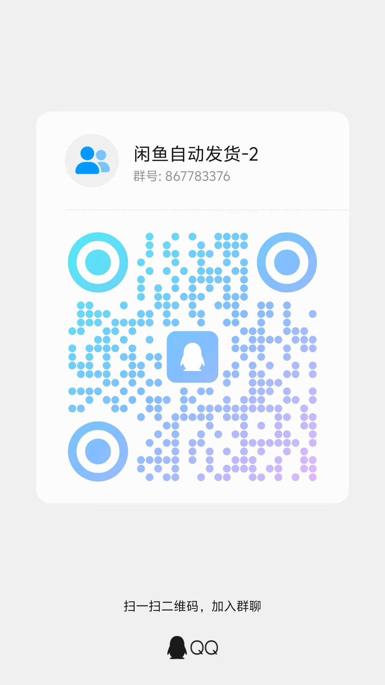

# 🐟 闲鱼自动回复系统

[](https://github.com/zhinianboke/xianyu-auto-reply)
[](https://github.com/zhinianboke/xianyu-auto-reply#-快速开始)
[](https://www.python.org/)
[](https://opensource.org/licenses/MIT)

一个功能完整的闲鱼自动回复和管理系统，支持多用户、多账号管理，具备智能回复、自动发货、自动确认发货、商品管理等企业级功能。

## ✨ 核心特性

### 🔐 多用户系统
- **用户注册登录** - 支持邮箱验证码注册，图形验证码保护
- **数据完全隔离** - 每个用户的数据独立存储，互不干扰
- **权限管理** - 严格的用户权限控制和JWT认证
- **安全保护** - 防暴力破解、会话管理、安全日志

### 📱 多账号管理
- **无限账号支持** - 每个用户可管理多个闲鱼账号
- **独立运行** - 每个账号独立监控，互不影响
- **实时状态** - 账号连接状态实时监控
- **批量操作** - 支持批量启动、停止账号任务

### 🤖 智能回复系统
- **关键词匹配** - 支持精确关键词匹配回复
- **商品专用回复** - 支持为特定商品设置专用关键词回复
- **通用关键词** - 支持全局通用关键词，适用于所有商品
- **批量导入导出** - 支持Excel格式的关键词批量导入导出
- **AI智能回复** - 集成OpenAI API，支持上下文理解
- **变量替换** - 回复内容支持动态变量（用户名、商品信息等）
- **优先级策略** - 商品专用关键词 > 通用关键词 > AI回复

### 🚚 自动发货功能
- **智能匹配** - 基于商品信息自动匹配发货规则
- **多规格支持** - 支持同一商品的不同规格自动匹配对应卡券
- **精确匹配+兜底机制** - 优先精确匹配规格，失败时自动降级到普通卡券
- **延时发货** - 支持设置发货延时时间（0-3600秒）
- **多种触发** - 支持付款消息、小刀消息等多种触发条件
- **防重复发货** - 智能防重复机制，避免重复发货
- **多种发货方式** - 支持固定文字、批量数据、API调用等发货方式
- **自动确认发货** - 检测到付款后自动调用闲鱼API确认发货
- **防重复确认** - 智能防重复确认机制，避免重复API调用
- **发货统计** - 完整的发货记录和统计功能

### 🛍️ 商品管理
- **自动收集** - 消息触发时自动收集商品信息
- **API获取** - 通过闲鱼API获取完整商品详情
- **多规格支持** - 支持多规格商品的规格信息管理
- **批量管理** - 支持批量查看、编辑、切换多规格状态
- **智能去重** - 自动去重，避免重复存储

### 🔍 商品搜索功能
- **真实数据获取** - 基于Playwright技术获取真实闲鱼商品数据
- **智能排序** - 按"人想要"数量自动倒序排列
- **多页搜索** - 支持一次性获取多页商品数据
- **前端分页** - 灵活的前端分页显示
- **商品详情** - 支持查看完整商品详情信息

### 📊 系统监控
- **实时日志** - 完整的操作日志记录和查看
- **性能监控** - 系统资源使用情况监控
- **健康检查** - 服务状态健康检查

### 📁 数据管理
- **Excel导入导出** - 支持关键词数据的Excel格式导入导出
- **模板生成** - 自动生成包含示例数据的导入模板
- **批量操作** - 支持批量添加、更新关键词数据
- **数据验证** - 导入时自动验证数据格式和重复性
- **多规格卡券管理** - 支持创建和管理多规格卡券
- **发货规则管理** - 支持多规格发货规则的创建和管理
- **数据备份** - 自动数据备份和恢复

## 📁 项目结构

```
xianyu-auto-reply/
├── 📄 核心文件
│   ├── Start.py                    # 项目启动入口，初始化所有服务
│   ├── XianyuAutoAsync.py         # 闲鱼WebSocket连接和消息处理核心
│   ├── reply_server.py            # FastAPI Web服务器和完整API接口
│   ├── db_manager.py              # SQLite数据库管理，支持多用户数据隔离
│   ├── cookie_manager.py          # 多账号Cookie管理和任务调度
│   ├── ai_reply_engine.py         # AI智能回复引擎，支持多种AI模型
│   ├── file_log_collector.py      # 实时日志收集和管理系统
│   ├── config.py                  # 全局配置文件管理器
│   └── secure_confirm_ultra.py    # 自动确认发货模块（多层加密保护）
├── 🛠️ 工具模块
│   └── utils/
│       ├── xianyu_utils.py        # 闲鱼API工具函数（加密、签名、解析）
│       ├── message_utils.py       # 消息格式化和处理工具
│       ├── ws_utils.py            # WebSocket客户端封装
│       ├── qr_login.py            # 二维码登录功能
│       ├── item_search.py         # 商品搜索功能（基于Playwright）
│       └── order_detail_fetcher.py # 订单详情获取工具
├── 🌐 前端界面
│   └── static/
│       ├── index.html             # 主管理界面（账号管理、系统监控）
│       ├── login.html             # 用户登录页面
│       ├── register.html          # 用户注册页面（邮箱验证）
│       ├── user_management.html   # 用户管理页面（管理员功能）
│       ├── data_management.html   # 数据管理页面（导入导出）
│       ├── log_management.html    # 日志管理页面（实时日志查看）
│       ├── item_search.html       # 商品搜索页面（真实数据获取）
│       ├── xianyu_js_version_2.js # 闲鱼JavaScript工具库
│       └── lib/                   # 前端依赖库（Bootstrap等）
├── 🐳 Docker部署
│   ├── Dockerfile                 # Docker镜像构建文件
│   ├── docker-compose.yml        # Docker Compose一键部署配置
│   ├── docker-deploy.sh          # Docker部署管理脚本
│   └── nginx/                    # Nginx反向代理配置
├── 📋 配置文件
│   ├── global_config.yml         # 全局配置文件（WebSocket、API等）
│   ├── requirements.txt          # Python依赖包列表
│   └── README.md                 # 项目说明文档
└── 📊 数据目录
    ├── xianyu_data.db            # SQLite数据库文件
    ├── logs/                     # 按日期分割的日志文件
    ├── backups/                  # 数据备份文件
    └── realtime.log              # 实时日志文件
```

## 🚀 快速开始

### 方式一：Docker 一键部署（最简单）

```bash
# 创建数据目录
mkdir -p xianyu-auto-reply

# 一键启动容器
docker run -d \
  -p 8080:8080 \
  -v $PWD/xianyu-auto-reply/:/app/data/ \
  --name xianyu-auto-reply \
  --privileged=true \
  registry.cn-shanghai.aliyuncs.com/zhinian-software/xianyu-auto-reply:1.0

# 访问系统
# http://localhost:8080
```

### 方式二：Docker Compose 部署（推荐）

```bash
# 1. 克隆项目
git clone https://github.com/zhinianboke/xianyu-auto-reply.git
cd xianyu-auto-reply

# 2. 一键部署
./docker-deploy.sh

# 3. 访问系统
# http://localhost:8080
```

#### 🔧 Docker部署故障排除

如果遇到构建问题，请参考 [Docker修复指南](DOCKER_FIX.md)

**常见问题**：
- **sqlite3错误**：已修复，sqlite3是Python内置模块，无需安装
- **Docker未运行**：确保Docker Desktop正在运行
- **端口冲突**：修改docker-compose.yml中的端口映射为其他端口
- **权限问题**：Linux系统下使用 `sudo ./docker-deploy.sh`

### 方式三：本地部署

```bash
# 1. 克隆项目
git clone https://github.com/zhinianboke/xianyu-auto-reply.git
cd xianyu-auto-reply

# 2. 安装依赖
pip install -r requirements.txt

# 3. 安装Playwright浏览器（商品搜索功能需要）
playwright install chromium

# 4. 启动系统
python Start.py

# 5. 访问系统
# http://localhost:8080
```

### 🐳 Docker 部署说明

#### 一键部署特点
- **无需配置** - 使用预构建镜像，开箱即用
- **数据持久化** - 自动挂载数据目录，数据不丢失
- **快速启动** - 30秒内完成部署
- **生产就绪** - 包含所有依赖和优化配置

#### 容器管理命令
```bash
# 查看容器状态
docker ps

# 查看容器日志
docker logs -f xianyu-auto-reply

# 停止容器
docker stop xianyu-auto-reply

# 重启容器
docker restart xianyu-auto-reply

# 删除容器
docker rm -f xianyu-auto-reply
```

## 📋 系统使用

### 1. 用户注册
- 访问 `http://localhost:8080/register.html`
- 填写用户信息，完成邮箱验证
- 输入图形验证码完成注册

### 2. 添加闲鱼账号
- 登录系统后进入主界面
- 点击"添加新账号"
- 输入账号ID和完整的Cookie值
- 系统自动启动账号监控任务

### 3. 配置自动回复
- **关键词回复**：设置关键词和对应回复内容
- **AI回复**：配置OpenAI API密钥启用智能回复
- **默认回复**：设置未匹配时的默认回复

### 4. 设置自动发货
- 添加发货规则，设置商品关键词和发货内容
- 支持文本内容和卡密文件两种发货方式
- 系统检测到付款消息时自动确认发货并自动发货

### 5. 使用商品搜索功能
- 访问商品搜索页面（需要登录）
- 输入搜索关键词和查询页数
- 系统自动获取真实闲鱼商品数据
- 商品按"人想要"数量自动排序
- 支持查看商品详情和跳转到闲鱼页面

## 🏗️ 系统架构

```
┌─────────────────────────────────────┐
│           Web界面 (FastAPI)         │
│         用户管理 + 功能界面          │
└─────────────┬───────────────────────┘
              │
┌─────────────▼───────────────────────┐
│        CookieManager               │
│         多账号任务管理              │
└─────────────┬───────────────────────┘
              │
┌─────────────▼───────────────────────┐
│      XianyuLive (多实例)           │
│     WebSocket连接 + 消息处理        │
└─────────────┬───────────────────────┘
              │
┌─────────────▼───────────────────────┐
│        SQLite数据库                │
│   用户数据 + 商品信息 + 配置数据     │
└─────────────────────────────────────┘
```

## 📁 核心文件功能说明

### 🚀 启动和核心模块
- **`Start.py`** - 项目启动入口，初始化所有服务和组件
- **`XianyuAutoAsync.py`** - 闲鱼WebSocket连接核心，处理消息收发和自动回复
- **`reply_server.py`** - FastAPI Web服务器，提供管理界面和API接口
- **`cookie_manager.py`** - 多账号Cookie管理，负责账号任务的启动和停止

### 🗄️ 数据和配置管理
- **`db_manager.py`** - SQLite数据库管理，处理用户数据、商品信息、关键词等
- **`config.py`** - 配置文件管理，加载和管理全局配置
- **`global_config.yml`** - 全局配置文件，包含所有系统配置项

### 🤖 智能功能模块
- **`ai_reply_engine.py`** - AI智能回复引擎，支持多种AI模型
- **`secure_confirm_ultra.py`** - 自动确认发货模块（超级加密保护）
- **`file_log_collector.py`** - 日志收集和管理，提供实时日志查看

### 🛠️ 工具模块
- **`utils/xianyu_utils.py`** - 闲鱼API工具函数，包含加密解密、签名生成等
- **`utils/message_utils.py`** - 消息格式化工具
- **`utils/ws_utils.py`** - WebSocket客户端工具
- **`utils/item_search.py`** - 商品搜索功能，基于Playwright技术

### 🌐 前端界面
- **`static/index.html`** - 主管理界面，账号管理和系统监控
- **`static/login.html`** - 用户登录页面
- **`static/register.html`** - 用户注册页面，支持邮箱验证
- **`static/user_management.html`** - 用户管理页面（管理员功能）
- **`static/data_management.html`** - 数据管理页面，关键词导入导出
- **`static/log_management.html`** - 日志管理页面，实时日志查看
- **`static/item_search.html`** - 商品搜索页面，获取真实闲鱼数据

### 🐳 部署配置
- **`Dockerfile`** - Docker镜像构建文件，包含完整运行环境
- **`docker-compose.yml`** - Docker Compose配置，支持一键部署
- **`docker-deploy.sh`** - Docker部署脚本，提供完整的部署管理功能
- **`.env`** - 环境变量配置文件，包含所有可配置项
- **`requirements.txt`** - Python依赖包列表

## ⚙️ 配置说明

### 管理员密码配置

**重要**：为了系统安全，强烈建议修改默认管理员密码！

#### 默认密码
- **用户名**：`admin`
- **默认密码**：`admin123`
- **初始化机制**：首次创建数据库时自动创建admin用户

#### 修改密码方式

**方式一：Web界面修改（推荐）**
1. 使用默认密码登录系统
2. 进入系统设置页面
3. 在"修改密码"区域输入当前密码和新密码
4. 点击"修改密码"按钮完成修改

**密码管理机制**：
- 数据库初始化时创建admin用户，密码为 `admin123`
- 重启时如果用户表已存在，不重新初始化
- 所有用户（包括admin）统一使用用户表验证
- 密码修改后立即生效，无需重启

### 全局配置文件
`global_config.yml` 包含详细的系统配置，支持：
- WebSocket连接参数
- API接口配置
- 自动回复设置
- 商品管理配置
- 日志配置等

## 🔧 高级功能

### AI回复配置
1. 在用户设置中配置OpenAI API密钥
2. 选择AI模型（支持GPT-3.5、GPT-4、通义千问等）
3. 设置回复策略和提示词
4. 启用AI回复功能

### 自动发货规则
1. 进入发货管理页面
2. 添加发货规则，设置商品关键词
3. 上传卡密文件或输入发货内容
4. 系统自动匹配商品并发货

### 商品信息管理
1. 系统自动收集消息中的商品信息
2. 通过API获取完整商品详情
3. 支持手动编辑商品信息
4. 为自动发货提供准确的商品数据

## 📊 监控和维护

### 日志管理
- **实时日志**：Web界面查看实时系统日志
- **日志文件**：`logs/` 目录下的按日期分割的日志文件
- **日志级别**：支持DEBUG、INFO、WARNING、ERROR级别

### 数据备份
```bash
# 手动备份
./docker-deploy.sh backup

# 查看备份
ls backups/
```

### 健康检查
```bash
# 检查服务状态
curl http://localhost:8080/health

# 查看系统状态
./docker-deploy.sh status
```

## 🔒 安全特性

- **JWT认证**：安全的用户认证机制
- **图形验证码**：防止自动化攻击
- **邮箱验证**：确保用户邮箱真实性
- **数据隔离**：用户数据完全隔离
- **会话管理**：安全的会话超时机制
- **操作日志**：完整的用户操作记录
- **代码加密**：核心业务逻辑采用多层加密保护

## 🛡️ 技术特性

### 🏗️ 架构设计
- **微服务架构**：模块化设计，易于维护和扩展
- **异步编程**：基于asyncio的高性能异步处理
- **WebSocket长连接**：实时消息处理，低延迟响应
- **RESTful API**：标准化的API接口设计

### 🔧 技术栈
- **后端框架**：FastAPI + Uvicorn
- **数据库**：SQLite（轻量级，无需额外配置）
- **前端技术**：原生HTML/CSS/JavaScript + Bootstrap
- **WebSocket**：实时双向通信
- **容器化**：Docker + Docker Compose

### 🚀 性能优化
- **连接池管理**：高效的数据库连接管理
- **异步处理**：非阻塞I/O操作
- **内存优化**：智能缓存和垃圾回收
- **资源限制**：Docker容器资源限制和监控

### 🔐 安全机制
- **多层加密**：敏感代码采用5层编码混淆
- **变量名随机化**：防止静态分析
- **运行时解密**：代码在内存中动态解密执行
- **防重复机制**：智能防重复确认和发货

## 🤝 贡献指南

欢迎为项目做出贡献！您可以通过以下方式参与：

### 📝 提交问题
- 在 [GitHub Issues](https://github.com/zhinianboke/xianyu-auto-reply/issues) 中报告Bug
- 提出新功能建议和改进意见
- 分享使用经验和最佳实践

### 🔧 代码贡献
- Fork 项目到您的GitHub账号
- 创建功能分支：`git checkout -b feature/your-feature`
- 提交更改：`git commit -am 'Add some feature'`
- 推送分支：`git push origin feature/your-feature`
- 提交 Pull Request

### 📖 文档贡献
- 改进现有文档
- 添加使用示例
- 翻译文档到其他语言

## 📞 技术支持

### 🔧 故障排除

**1. 问题排查**
1. 查看日志：`docker-compose logs -f`
2. 检查状态：`./docker-deploy.sh status`
3. 健康检查：`curl http://localhost:8080/health`

### 💬 交流群组

欢迎加入我们的技术交流群，获取实时帮助和最新更新：

#### 微信交流群


#### QQ交流群


### 📧 联系方式
- **技术支持**：遇到问题可在群内咨询
- **功能建议**：欢迎提出改进建议
- **Bug反馈**：发现问题请及时反馈

## 🧸 特别鸣谢

本项目参考了以下开源项目：

- **[XianYuApis](https://github.com/cv-cat/XianYuApis)** - 提供了闲鱼API接口的技术参考
- **[XianyuAutoAgent](https://github.com/shaxiu/XianyuAutoAgent)** - 提供了自动化处理的实现思路

感谢这些优秀的开源项目为本项目的开发提供了宝贵的参考和启发！

---

🎉 **开始使用闲鱼自动回复系统，让您的闲鱼店铺管理更加智能高效！**
